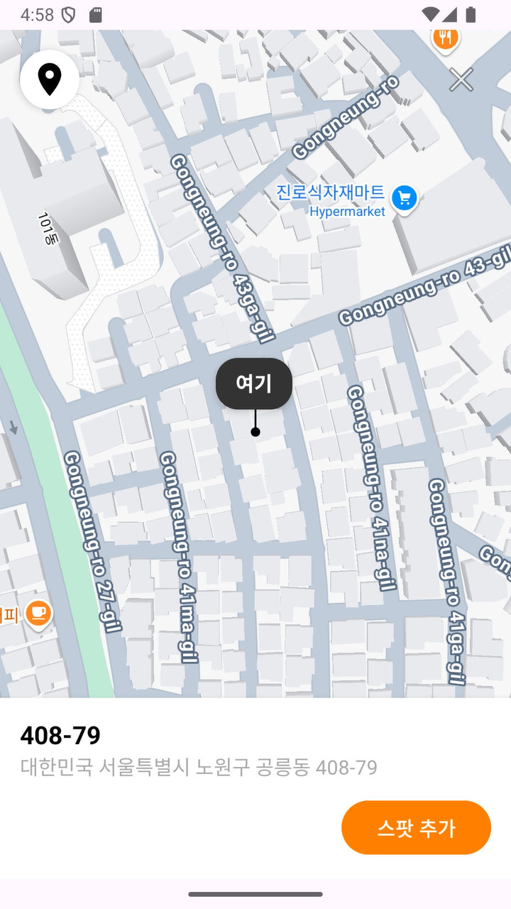
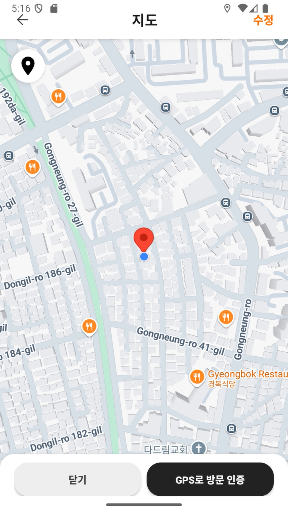
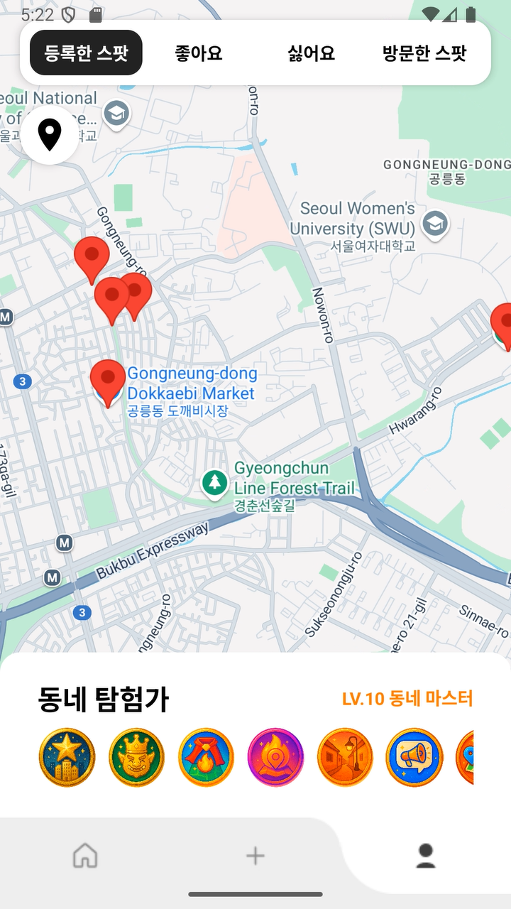

# 2025_GURU2_Android
## MyMaps

지도 기반으로 장소를 등록하고 관리할 수 있는 안드로이드 앱입니다.  
Room DB와 MVVM 아키텍처를 활용해 데이터 일관성과 유지보수성을 높였습니다.

  
  
  
  
  

---

## 주요 기능

- 장소(Spot) 등록, 삭제, 조회
- 지도에서 장소 위치 확인
- 실시간 UI 업데이트 (LiveData & ViewModel)

---

## 역할
- 안드로이드 개발 담당
- 지도 API 연동 (Kakao Map)
- Room DB 설계 및 데이터 CRUD 기능 구현
- MVVM 패턴 적용 및 ViewModel, LiveData 활용
- UI 개발 및 RecyclerView 기반 리스트 구현

---

## 사용 기술

- **언어:** Kotlin  
- **아키텍처:** MVVM  
- **DB:** Room (SQLite 기반 ORM)  
- **기타:** LiveData, ViewModel, RecyclerView  

---

## 설치 및 실행

1. 리포지토리 클론:
git clone https://github.com/username/MyMaps.git
2. Android Studio에서 프로젝트 열기
3. Gradle 동기화 후 앱 실행
